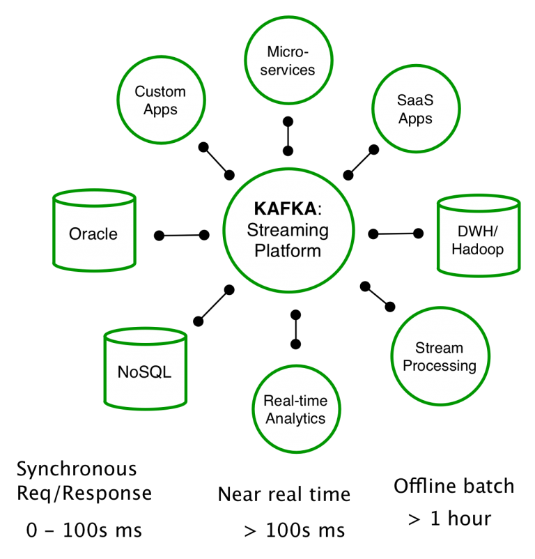

카프카 서비스의 출발
---
#### 카프카 서비스의 지향점

- 카프카 서비스는 메시지 전달의 중앙 플랫폼으로서 기업의 모든 데이터 시스템, 마이크로서비스, 앱 등과 연결할 수 있는 파이프라인을 제공하는 것을 목표로 개발되었음.
    - A distributed streaming platform

#### 카프카의 동장방식과 원리
- 카프카 = 메시징 서버, Pub/Sub 모델에 의해 돌아감.
    - 데이터 단위를 보내는 측 = Publisher or Producer
    - 데이터를 가져가는 측 = Subscriber or Consumer
    - Publish의 경우 직접 Subscriber에게 전달하는 것이 아니라 중간 메시징 시스템(kafka)에 전달함.
    - 카프카의 경우 메시징 시스템의 단점을 극복하기 위해 프로듀서와 컨슈머에 그 역할을 전달하여 고성능 메시징 시스템을 구현하였음. 
> Producer -> (Pub:Message) -> kafka(topic) -> (Sub:Message) -> Subscriber

- Pub/Sub 방식이란?
    - 비동기 메시징 전송방식, 수신자가 정해지지 않은 상태로 Publish > 수신자의 Subscribe
    - 메시징 시스템 중심으로 확장성이 용이하며, 데이터 유실의 염려가 없음
    - 단점으로는 직접 통신이 아니므로, 확인하는 코드로 복잡해지며 전달 속도가 느림.
    - 기존의 Pub/Sub의 경우 내부 구조가 복잡해지므로 대규모 데이터 보다는 간단한 이벤트 전송에 사용되었음.

#### 카프카의 특징
- 비동기기반 메시징 큐 솔루션, 대표적으로 래빗엠큐 같은 것들이 존재하나, 카프카만의 차별점이 존재함.
    1. Producer, Consumer의 분리 : 메트릭 수집 방식의 경우 기존 폴링방식으로 구현 시 수집/처리가 늦어지는 현상이 발생, 이러한 현상을 막고자 Pub/Sub 방식 사용. 기존 방식의 경우 서버 연결이 매우 복잡해지고, 서버 증설 시 연동 등의 문제가 발생. 카프카를 이용하면 안정적이고 단순한 구성을 구현할 수 있음.
    2. Multi Producer, Multi Consumer : 하나의 토픽에 여러 Pub/Sub이 접근 가능함. 데이터 분석 및 처리 프로세스에서 데이터가 다양하게 사용되어야하는 경우에 대처가 쉬움.
    3. Message를 디스크에 저장, 유지 : 일반적인 메시징 시스템은 메시지가 Subscribe 되면 삭제되나, 카프카는 디스크에 보존함. 
    4. 확장성 : 카프카 클러스터 구성 이후에도 쉽게 확장할 수 있음. 
    5. 고성능 : 카프카의 개발 목표는 고성능 메시징 시스템.
    
#### 카프카의 확장과 발전
- 고성능 메시징 시스템 카프카의 도입으로 SOA, 그 중에서도 ESB를 쉽게 구현 가능해짐
    - SOA : Service Oriented Architecture, 업무 서비스 단위로 쪼갬
    - ESB : Enterprise Service Bus, 1) 다양한 시스템과 연동을 위해 멀티 프로토콜과 데이터 타입 지원, 2) 느슨한 결합을 위한 메시지 큐 지원, 3) 정기적으로 데이터를 가져오는 이벤트 기반 통신
- 단순 메시징을 전달하는 역할을 넘어서 카프카 스트림즈 / KSQL 등의 분석시스템으로 진화
    - 스파크, 스톰과 같은 엔지니어가 필요한 영역에 어느 정도 대응하기 위해 도입    

