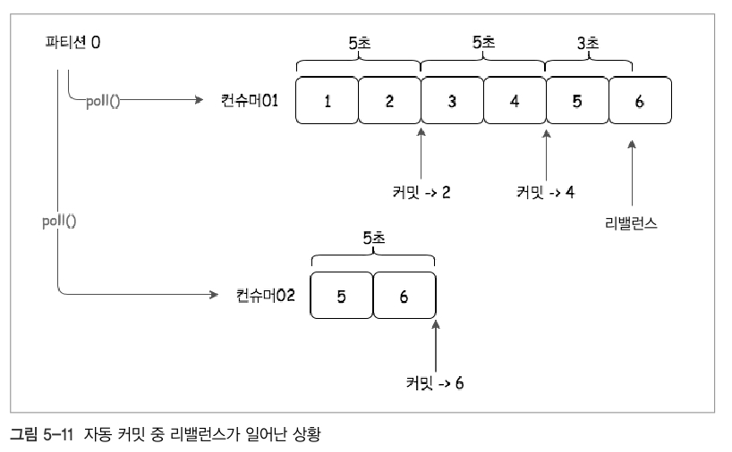

카프카 컨슈머
---
프로듀서가 생산한 메시지를 토픽을 거쳐 소비하는 역할

카프카 컨슈머 주요 옵션
---
- 카프카 컨슈머의 종류는 두가지
    - 올드 컨슈머 : 컨슈머의 오프셋을 주키퍼의 지노드에 저장 (will be deprecated)
    - 뉴 컨슈머 : 컨슈머의 오프셋을 카프카의 토픽에 저장

* [Kafka Consumer Configuration](https://kafka.apache.org/documentation/#consumerconfigs)
* [Kafka-Python Consumer Configuration](https://kafka-python.readthedocs.io/en/latest/apidoc/KafkaConsumer.html)
* [PyKafka (Simple) Consumer Configuration](https://pykafka.readthedocs.io/en/2.3.0/api/simpleconsumer.html)

- bootstrap.servers
    - 카프카 프로듀서와 동일, 카프카 클러스터 호스트들을 지정 
- fetch.min.bytes 
    - 한번에 가져올 수 있는 최소 데이터 사이즈. 지정한 사이즈 보다 작으면 요청에 응답하지 않고 누적되어 조건에 만족할때 까지 기다림.
- group.id
    - 컨슈머의 그룹에 대한 식별자, 그룹 아이디는 매우 중요한 옵션.
- enable.auto.commit 
    - 주기적으로 오프셋 정보를 커밋.(백그라운드)
- auto.offset.reset 
    - 카프카에서 초기 오프셋이 없거나, 현재 오프셋이 더 이상 존재하지 않는 경우 리셋을 지정
        - earliest : 가장 초기 오프셋값
        - latest : 가장 마지막(최근)의 오프셋값
        - none : catch error
- fetch.max.bytes
    - 한번에 가져올 수 있는 최대 데이터 사이즈
- request.timeout.ms   
    - 요청을 기다리는 최대 응답시간
- session.timeout.ms
    - 컨슈머와 브로커 사이의 세션 타임아웃 시간. 브로커가 컨슈머의 하트비트를 기다리는 최대 시간.
    - 만약 이 시간이 지나면 컨슈머 그룹이 rebalance를 시도함.
    - 일반적으로 heartbeat.interval.ms 옵션과 같이 설정됨. 
    - 너무 짧으면 장애 감지는 잘되지만, 원치 않는 리밸런싱이 이렁남. 
- heartbeat.interval.ms 
    - KafkaConsumer poll() 메소드로 하트비트를 보내는 시간을 조절하는 옵션
    - session.timeout.ms 보다 작아야함.(일반적으로 1/3)
- max.poll.records 
    - poll() 단일 호출에 대한 레코드 수 조정. 폴링 루프에서 데이터 양을 조절
- max.poll.interval.ms 
    - 하트비트를 보내도 메시지를 가져가지 않는 방식의 점유를 막는 옵션. 주기적으로 poll() 호출이 없으면 장애로 판단하고 다른 컨슈머에게 배정
- fetch.max.wait.ms     
    - fetch.max.bytes 에 설정된 데이터보다 적은 경우 요청에 응답을 기다리는 최대 시간. 

콘솔 컨슈머로 메시지 가져오기
---

```shell script
/usr/local/kafka/bin/kafka-console-consumer.sh \
--bootstrap-server k1:9092,k2:9092,k3:9092,k4:9092,k5:9092 \
--topic test-topic \
--group test-consumer-group \
--from-beginning 
```
- 컨슈머 그룹 확인하기
```shell script
/usr/local/kafka/bin/kafka-consumer-groups.sh \
--bootstrap-server k1:9092,k2:9092,k3:9092,k4:9092,k5:9092 \
--list 
```

파이썬(자바) 컨슈머
---
```python
from kafka import KafkaConsumer

consumer = KafkaConsumer('test-topic',
                         group_id = 'test-consumer-group',
                         bootstrap_servers = "k1:9092,k2:9092,k3:9092,k4:9092,k5:9092",
                         enable_auto_commit = True, 
                         auto_offset_reset = 'latest' )
# consumer = Iterable
```
- 메시지를 불러오는 방식은, 컨슈머 인자를 지정하고, consumer 내부에 있는 정보를 poll 호출하여 가져옴.

파티션과 메시지 순서
---
- 컨슈머의 경우 프로듀서에서 넘어온 메시지의 순서가 그대로 보장되지 않음.
    - 카프카 컨슈머에서의 메시지순서는 동일한 파티션 내에서는 그대로 처리되지만, 파티션 사이의 순서를 보장하지는 않는다. 
```shell script
## 각각의 파티션에 저장된 메시지를 불러옴
# 파티션 0
/usr/local/kafka/bin/kafka-console-consumer.sh \
--bootstrap-server k1:9092,k2:9092,k3:9092,k4:9092,k5:9092 \
--topic test-topic \
--partition 0 \
--from-beginning

# 파티션 1
/usr/local/kafka/bin/kafka-console-consumer.sh \
--bootstrap-server k1:9092,k2:9092,k3:9092,k4:9092,k5:9092 \
--topic test-topic \
--partition 1 \
--from-beginning

# 파티션 2
/usr/local/kafka/bin/kafka-console-consumer.sh \
--bootstrap-server k1:9092,k2:9092,k3:9092,k4:9092,k5:9092 \
--topic test-topic \
--partition 2 \
--from-beginning
```
- 만약 카프카의 토픽으로 메시지를 주고 받을 때 순서를 정확하게 보장하고자 한다면, 파티션 수를 1로 지정해야함.
    - 순서는 보장하지만, 분산처리를 보장하지 못하기 때문에 고려하여 작성해야함.
    
컨슈머 그룹
---
* 컨슈머 그룹은 하나의 토픽에 여러 컨슈머 그룹이 동시에 접속해 메시지 접근이 가능한데, 이는 기존 메시징 큐 솔루션에서 메시지를 가져가면 큐에서 삭제되어 가져갈 수 없던 단점을 보완한 것.
* 프로듀서의 메시지 생산속도와 컨슈머의 메시지 소비속도가 차이가 많이 나는 경우 컨슈머를 확장해야함.
    - 여기서 문제는 단순히 갯수만 늘릴경우 오프셋 정보가 혼재하여 문제가 발생할 수 있음
    - 컨슈머 그룹은 컨슈머 확장을 용이하게 하고 컨슈머의 장애에도 대처가 용이함. 
* 컨슈머 그룹 내에 컨슈머를 추가하게 되면, 파티션에 대한 소유권을 조정하는 과정이 발생함. 이것이 리밸런스(rebalance)
    - 리밸런스의 단점은 리밸런스 과정에서 일시적으로 메시지를 가져올 수 없음. 
* 토픽의 파티션에 컨슈머는 한개만 연결이 가능한데 그 이유는 오프셋 정보가 혼재되면 메시지 순서를 보장할 수 없기 때문이다.
    - 컨슈머 하나에 여러개 파티션이 연결되는 것은 가능함.
* 프로듀서와 컨슈머 사이의 언밸런싱 문제는 파티션과 컨슈머의 수를 적절히 조절해야하는 필요성이 있다.
* 컨슈머가 파티션의 소유권(연결)을 유지하는 방식은 하트비트를 보내는 것
    - 하트비트는 컨슈머가 poll 하는 경우와 가져간 메시지의 오프셋을 커밋할 때 보내짐.
* 카프카의 큰 특징은 컨슈머가 메시지를 가져가면 그 메시지를 삭제하지 않는다는 것. 해당 토픽을 여러 용도로 사용 가능해짐

커밋과 오프셋
---
- poll: 컨슈머가 poll 호출할 때마다 카프카에 저장되어있는 아직 읽지 않은 메시지를 가져옴
    - 이것이 가능한 이유는 바로 어디까지 메시지를 가져갔는지 기록해놨기 때문.
- commit: 컨슈머들은 각각의 파티션에 자신이 가져간 메시지의 오프셋을 저장하고 있음. 이를 업데이트 하는 것을 commit 이라고 부름
- 현재 오프셋 정보는 카프카 내`__consumer_offsets`에 저장되어있음
    - 컨슈머의 장애로 리밸런스가 일어나면 가장 최근 커밋된 오프셋을 기준으로 메시지를 가져옴
    - 만약 커밋이 이루어지지 않아 가장 최근 메시지와 차이가 생기면 누락 혹은 중복 되기 때문에 커밋 과정은 매우 중요함.
    
#### 오토커밋
* 오프셋을 직접 관리, 커밋하는 것 보다는 직접 관리하지 않는 방안이 더 낫기도 함.
```shell script
enable.auto.commit=true
```
* 위 옵션을 설정하면 기본으로 5초마다 컨슈머는 poll 과정에서 가장 마지막(최근) 오프셋을 커밋함. 만약 수정하고 싶다면 아래 옵션을 조절하면 됨.
```shell script
auto.commit.interval.ms=3
``` 
* 하지만 5초 혹은 설정한 시간 내에 리밸런싱이 일어나면 중복의 문제가 발생할 수 있음
    - 3초에 리밸런싱이 일어나면 5번 오프셋이 중복이 일어남


#### 수동커밋
* 수동커밋의 경우 특정 상황에서 사용할 필요가 있음.
    - 예를 들어 메시지 처리가 완료되기 전까지 메시지를 가져왔다고 처리되어서는 안되는 경우.
        - 메시지를 DB에 저장할 경우 DB에 저장된 오프셋까지만 커밋을 해주어야함

#### 특정 파티션 할당
* 컨슈머를 공평하게 분배하는 경우가 아니라, 특정 파티션에 대해 세밀한 제어가 필요할 수 있음
    - 특정 파티션의 메시지만 가져와야하는 경우
    - 컨슈머이 실패나 재조정이 필요가 없는 고가용성 시스템. 
* 특정 파티션에 대한 할당을 할 경우 같은 컨슈머 그룹아이디를 공유하는 것이 아니라 서로 다른 그룹 아이디를 가져야함. 
    - 그렇지 못하면 오프셋정보를 서로 공유하기 때문에 잘못된 소비가 되어버림.
    
#### 특정 오프셋 할당
* 중복의 문제를 처리하기 위해 오프셋 관리를 수동으로 해야하는 경우 해당 지점을 가져와야함
    - seek() 메소드를 사용하면 다음 poll() 호출하는 위치를 지정할 수 있음.


